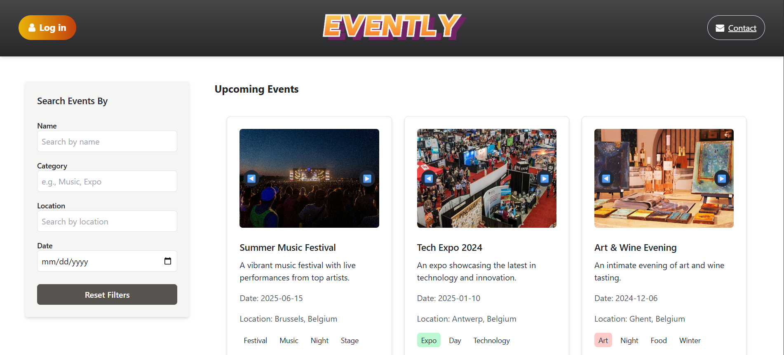

# Project description

# 🎉 Evently

**Evently** is a full-stack web application that allows users to explore upcoming events by category, location, and date — and register for their favorites.  
Users can create accounts to manage bookings and receive event updates.  

---




## 🧩 Tech Stack

| Layer | Technology |
| :---- | :---------- |
| **Frontend** | Next.js • React • Tailwind CSS |
| **Backend** | Express.js • Prisma ORM • PostgreSQL |

## Project analysis
In analysis folder you can find data models and project pitch with user stories and wireframes for **Evently**.


## 💻 Run Locally

Follow these steps to set up **Evently** on your local machine.

### 1️⃣ Clone the Repository

```bash
git clone https://github.com/UCLL-Full-stack/project2425-ti-group4-16.git

```

### 2️⃣ Create the Database and User

Run the following commands in **psql**:

```sql
CREATE DATABASE evently;

-- Create a dedicated user
CREATE USER evently_user WITH PASSWORD 'evently_pass';
GRANT ALL PRIVILEGES ON DATABASE evently TO evently_user;
```

### 3️⃣ Backend Setup
- Create .env file according to .env.example in the root of backend folder
- Navigate to the backend directory:

```bash
cd backend
npm install
npx prisma generate
npx prisma migrate dev --name init
npx ts-node util/seed.ts
npm run start
```


### 4️⃣ Frontend Setup
- Create .env file as .env.example in the root of frontend folder
- Start frontend:

```bash
cd frontend
npm install
npm run dev   

